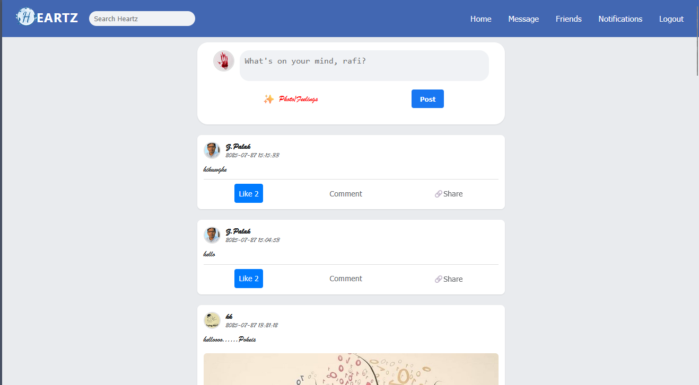
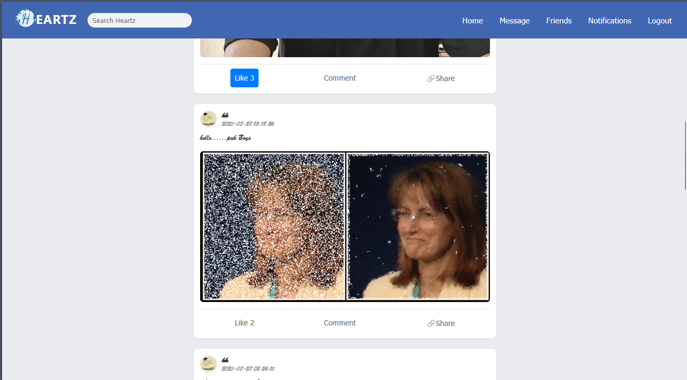
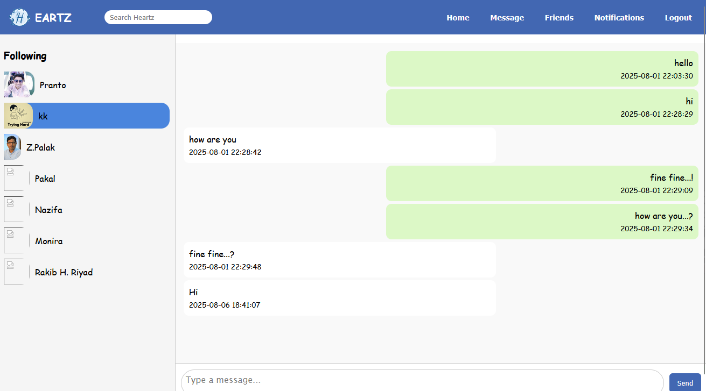
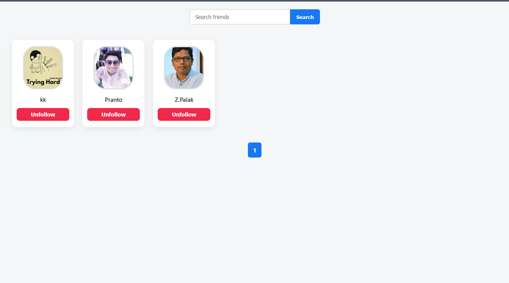
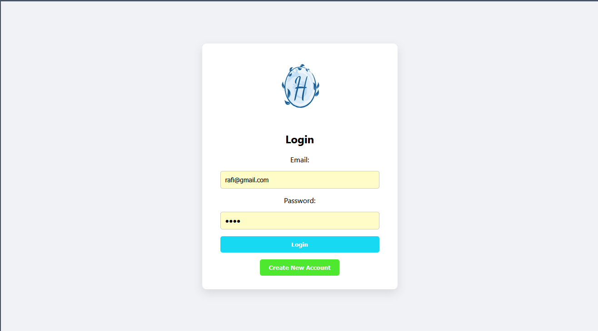

# 💖 Heartz – Social Media Platform  

  
  
  

**Heartz** is a learning-oriented social media platform built in **PHP** with a **MySQL** backend.  
It replicates core features of popular social platforms, helping beginners understand backend logic, database integration, and real-time features.  

---

## ✨ Features  

- 📝 **Posting** – Share your updates  
- 💬 **Real-Time Messaging** – Only between mutual followers  
- ❤️ **Likes & Comments** – Engage with posts  
- 👥 **Follow / Unfollow** – Connect with people  
- 🔐 **Login / Logout & Registration**  
- 📜 **News Feed** – At least 30 posts from friends + some random posts  

---

## 🗂 Project Structure  

Social-Media/
├── database/
│ └── heartz.sql # Database dump
├── assets/ # Images, stylesheets, scripts
├── includes/ # PHP logic files
├── index.php # Main entry point
└── ...

yaml
Copy
Edit

---

## ⚙️ Installation  

1. **Clone the repository** into your `htdocs` folder:  
   ```bash
   git clone https://github.com/Abnoxious-rafi/Social-Media.git
Run XAMPP and start Apache + MySQL.

Import the database:

Open phpMyAdmin

Create a new database (e.g., heartz)

Import database/heartz.sql

Configure Database Connection (if needed) inside your PHP config files.

Open in Browser:

arduino
Copy
Edit
http://localhost/Social-Media

# 🎯 Purpose
This project is a practice environment to:

 Learn PHP and MySQL

 Understand social media backend workflows

 Implement real-time messaging logic

 Explore database-driven web development

# 📌 Tech Stack
Backend: PHP

Database: MySQL (phpMyAdmin)

Frontend: HTML, CSS, JavaScript

Server: XAMPP
Database: MySQL (phpMyAdmin)

Frontend: HTML, CSS, JavaScript

Server: XAMPP

# Some pic of this project
## Screenshots

<details>
  <summary>Click to view screenshots (6 images)</summary>

  <p align="center">
    <a href="demo_pic/1.png"></a>
    <a href="demo_pic/2.png"></a>
    <a href="demo_pic/3.png"></a>
    <br>
    <a href="demo_pic/4.png"></a>
    <a href="demo_pic/5.png"></a>
    <a href="demo_pic/6.png"></a>
  </p>

  *Click any image to open full-size.*
</details>


